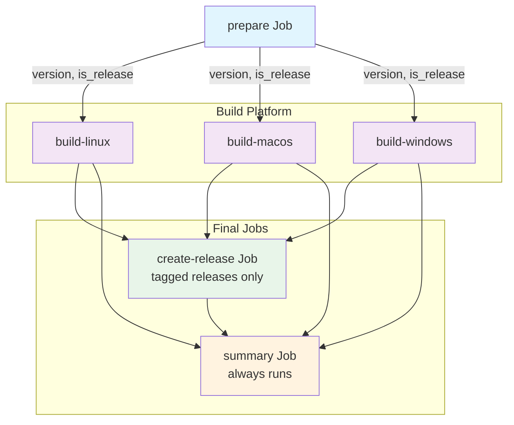

# CI/CD Pipeline for F.O.C.U.S. Attention App

This document explains how the GitHub Actions CI/CD pipeline works for building and releasing the F.O.C.U.S. Attention Electron application.

## Overview

The pipeline automatically builds and packages the Electron application for three platforms:
- **Linux** → AppImage
- **macOS** → DMG
- **Windows** → Portable EXE

## Trigger Conditions

The workflow triggers on:

1. **Push to master branch** - After a PR is merged
2. **Version tag push** - When a tag matching `v*.*.*` is pushed (e.g., `v1.0.0`, `v2.3.4`)

```yaml
on:
  push:
    branches:
      - master
    tags:
      - 'v*.*.*'
```

## Workflow Structure



## Jobs

### 1. prepare

**Purpose**: Extract version information and validate the build environment.

**Outputs**:
- `version`: Semantic version string (e.g., "1.0.0")
- `is_release`: `true` for tagged releases, `false` for other builds

**Steps**:
1. Checkout repository
2. Extract version from git tag (removes `v` prefix)
3. Validate version format (X.Y.Z)
4. Display build information

### 2. build-linux

**Purpose**: Build Linux AppImage package.

**Runner**: Ubuntu container

**Steps**:
1. Install system dependencies (libnss3, libgtk-3-0, etc.)
2. Install npm dependencies
3. Rebuild native modules for Electron
4. Build TypeScript and Renderer
5. Build AppImage with electron-builder
6. Generate SHA256 checksum
7. Upload artifact (7-day retention)

### 3. build-macos

**Purpose**: Build macOS DMG package.

**Runner**: macOS-latest

**Steps**:
1. Install npm dependencies
2. Rebuild native modules for Electron
3. Build TypeScript and Renderer
4. Build DMG with electron-builder
5. Generate SHA256 checksum
6. Upload artifact (7-day retention)

### 4. build-windows

**Purpose**: Build Windows portable EXE.

**Runner**: Windows-latest with Wine

**Steps**:
1. Install Wine (for building Windows on Linux/macOS)
2. Install npm dependencies
3. Rebuild native modules for Electron
4. Build TypeScript and Renderer
5. Build portable EXE with electron-builder
6. Generate SHA256 checksum
7. Upload artifact (7-day retention)

### 5. create-release (Tagged Releases Only)

**Purpose**: Create GitHub release with all artifacts.

**Runs**: Only when `is_release == true`

**Steps**:
1. Download all platform artifacts
2. Flatten artifact directory structure
3. Create GitHub release with release notes
4. Attach all build artifacts
5. Include installation instructions

### 6. summary

**Purpose**: Display build summary in GitHub Actions UI.

**Runs**: Always (even on failure)

**Output**:
- Version information
- Build status for each platform
- List of generated artifacts

## Artifact Naming

All artifacts follow the naming convention: `focus-v{version}-{platform}.{ext}`

| Platform | Extension | Example |
|----------|-----------|---------|
| Linux | .AppImage | focus-v1.0.0-linux.AppImage |
| macOS | .dmg | focus-v1.0.0-macOS.dmg |
| Windows | .exe | focus-v1.0.0-windows.exe |

Each artifact also includes a SHA256 checksum file: `{artifact}.sha256sum`

## Security

### Code Signing

The workflow includes placeholders for code signing certificates:

```yaml
# macOS
CSC_LINK: ${{ secrets.MACOS_CERTIFICATE }}
CSC_KEY_PASSWORD: ${{ secrets.MACOS_CERTIFICATE_PASSWORD }}

# Windows
CSC_LINK: ${{ secrets.WINDOWS_CERTIFICATE }}
CSC_KEY_PASSWORD: ${{ secrets.WINDOWS_CERTIFICATE_PASSWORD }}
```

**Secrets required** (configure in GitHub repository settings):
- `MACOS_CERTIFICATE` - Apple Developer ID certificate (base64)
- `MACOS_CERTIFICATE_PASSWORD` - Certificate password
- `WINDOWS_CERTIFICATE` - Windows code signing certificate (base64)
- `WINDOWS_CERTIFICATE_PASSWORD` - Certificate password

### Concurrency

```yaml
concurrency:
  group: ${{ github.workflow }}-${{ github.ref }}
  cancel-in-progress: true
```

This prevents multiple builds for the same ref and cancels in-progress builds when a new commit is pushed.

## Caching

The workflow uses:
- **npm cache** - Speeds up dependency installation
- **GitHub Actions artifact storage** - 7-day retention

## Testing the Pipeline

### 1. Create a test tag

```bash
git tag v0.0.1-test
git push origin v0.0.1-test
```

### 2. Monitor the build

1. Go to your repository's **Actions** tab
2. Watch the "Build and Release Electron App" workflow
3. Check each job's logs for errors

### 3. Verify artifacts

After builds complete:
1. Download artifacts from the workflow run
2. Verify SHA256 checksums
3. Test installation on each platform

### 4. Cleanup

```bash
git tag -d v0.0.1-test
git push origin :refs/tags/v0.0.1-test
```

## Troubleshooting

### Native Module Build Failures

Ensure `npm run electron-rebuild` runs successfully:
```bash
# Locally
npm run electron-rebuild
```

### Windows Build Issues

Verify Wine installation:
```bash
wine64 --version
```

### Artifact Upload Failures

Check file size limits (GitHub limits 2GB per artifact).

### Version Extraction Fails

Ensure tags follow semantic versioning:
- Must match pattern `vX.Y.Z` (e.g., `v1.0.0`, `v2.3.4`)
- No pre-release suffixes (use `v1.0.0-rc1` for release candidates)

## Configuration Files

### Workflow File

`.github/workflows/build-and-release.yml` - Main CI/CD pipeline

### Composite Actions

| File | Purpose |
|------|---------|
| `.github/actions/electron-build-common/action.yml` | Shared build steps |
| `.github/actions/electron-build-linux/action.yml` | Linux-specific steps |
| `.github/actions/electron-build-macos/action.yml` | macOS-specific steps |
| `.github/actions/electron-build-windows/action.yml` | Windows-specific steps |

### Application Build Config

`package.json` - electron-builder configuration:

```json
{
  "build": {
    "appId": "com.konsulin.focus",
    "productName": "F.O.C.U.S. Attention",
    "directories": {
      "output": "release"
    }
  }
}
```

## Production Release Checklist

Before creating a production release:

- [ ] All tests pass locally
- [ ] Code reviewed and merged to master
- [ ] Version bump in `package.json`
- [ ] Changelog updated
- [ ] Git tag created with semantic version
- [ ] Tag pushed to trigger workflow
- [ ] All platform builds complete successfully
- [ ] Artifacts tested on each platform
- [ ] GitHub release created and published

## Support

For issues or questions:
- Check workflow run logs in GitHub Actions
- Verify all secrets are configured
- Test builds locally before pushing tags
