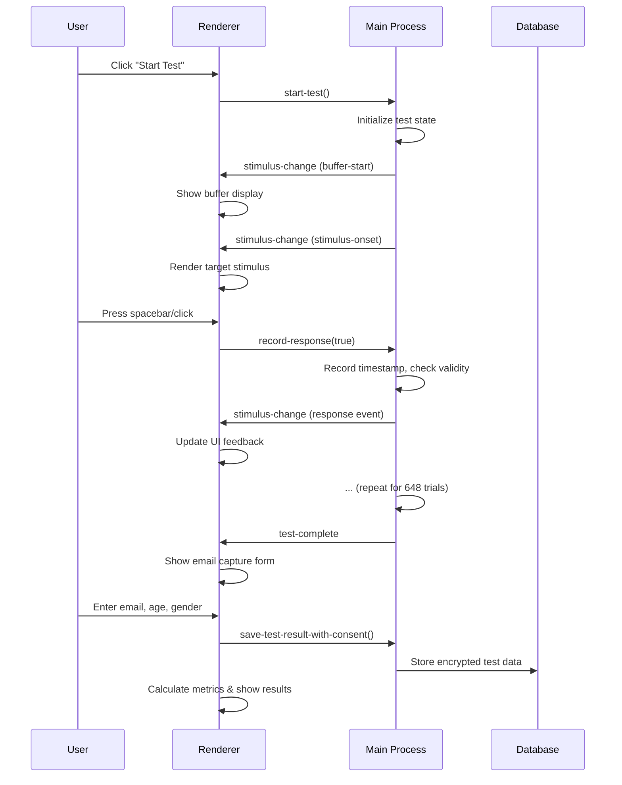
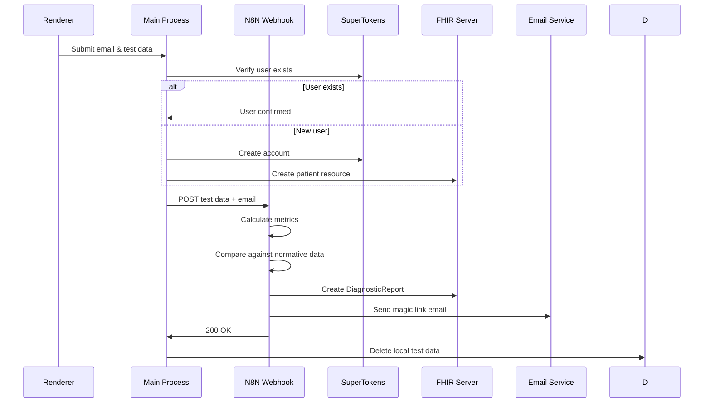

# System Architecture Overview

Two-tier architecture: Electron desktop client for test execution, serverless N8N backend for result processing.

## Client Architecture (Electron Application)

### Main Process Layer:
- Timing Engine: High-precision event capture using Node.js process.hrtime.bigint()
- Database Manager: SQLite operations for local test data persistence
- IPC Handler: Secure communication bridge between main and renderer processes
- Network Manager: HTTPS client for webhook communication with retry logic (not yet implemented)
- Auth Integration: SuperTokens SDK for user verification (not yet implemented)

### Renderer Process Layer:
- React UI Components: Test screen, stimulus presentation, email capture form
- State Management: Zustand store for test session state
- Animation Controller: requestAnimationFrame synchronization for stimulus timing
- Input Handlers: Keyboard/mouse event capture with IPC forwarding

### Preload Layer:
- Context Bridge: Exposes secure API from main process to renderer
- Type-safe IPC channels for timing events and data operations

## Data Flow - Test Execution

## Data Flow - Result Submission (Future)

## Server Architecture (Serverless N8N) - Future

### N8N Workflow Nodes:
1. Webhook Trigger: Receives POST with raw test data and email
2. SuperTokens Query: HTTP request to check user existence
3. Conditional Branch: User exists vs new user path
4. FHIR Patient Lookup: Query existing patient resource if user exists
5. User Creation: SuperTokens account + FHIR patient resource if new
6. Metric Calculation: JavaScript function node computes F.O.C.U.S. variables
7. Normative Data Fetch: PostgreSQL query filtered by age/gender
8. Statistical Comparison: JavaScript function computes percentiles
9. FHIR Write: Create DiagnosticReport resource with observations
10. Magic Link Generation: JWT token with expiration
11. Email Dispatch: SendGrid/SMTP with result access link
12. Response: Return 200 OK to client

### Supporting Infrastructure (Future):
- PostgreSQL Database: Stores user accounts, normative samples, FHIR resources
- HAPI FHIR Server: Healthcare data repository following HL7 FHIR standard
- SuperTokens Instance: Authentication and session management
- Email Service: Transactional email delivery

## Key Technical Decisions

### Decision: Use Electron instead of web browser
**Rationale:** Browser timing APIs cannot achieve ±1ms precision required for clinical validity. Electron provides Node.js access to process.hrtime.bigint() with nanosecond resolution and direct OS event handling.

### Decision: Client-side test execution
**Rationale:** Eliminates network latency as variable in timing measurements. Ensures test reliability even with poor internet connectivity. Reduces server load to near-zero during testing.

### Decision: SQLite for local storage
**Rationale:** Embedded database requires no separate service. Synchronous API simplifies error handling. Supports encryption for HIPAA compliance. Automatically deleted after successful upload.

### Decision: N8N serverless workflow (future)
**Rationale:** Visual workflow builder reduces development complexity. No infrastructure to manage. Pay-per-execution cost model. Easy to modify processing logic without code deployment.

### Decision: Separate builds per platform
**Rationale:** Electron cannot produce universal binary. Platform-specific builds enable native installers and code signing. Industry-standard approach with electron-builder.

### Decision: IPC for timing events
**Rationale:** Renderer process timing is unreliable due to browser engine constraints. Main process has direct OS access. IPC latency (<1ms) acceptable when main process captures actual timestamps.

## Design Patterns

- **Command Pattern:** User actions in renderer dispatched as commands to main process
- **Observer Pattern:** Timing engine emits events consumed by multiple listeners
- **Repository Pattern:** Database manager abstracts SQLite operations
- **Strategy Pattern:** Different retry strategies for network failures
- **Factory Pattern:** Test session factory creates configured timing instances

## Critical Implementation Paths

### Path 1: Stimulus Presentation Accuracy
- Renderer requests stimulus display with intended timestamp
- requestAnimationFrame syncs to display vblank
- Main process records actual presentation time
- Delta between intended and actual logged for quality control

### Path 2: Response Capture Precision
- OS-level input event captured
- Main process immediately calls process.hrtime.bigint()
- Timestamp stored before any processing
- Response matched to stimulus in post-processing

### Path 3: Data Integrity During Upload
- Test data serialized to JSON
- Encrypted and written to SQLite
- HTTPS POST attempted with timeout
- On success: DELETE from SQLite
- On failure: Record remains for retry, user notified

### Path 4: Offline Resilience
- Application detects network availability before upload
- Queues results locally if offline
- Background service retries on app launch
- User can manually trigger retry from UI

## Component Relationships

### Electron Main Process owns:
- TimingEngine (creates timing events)
- DatabaseManager (persists test data)
- NetworkManager (communicates with N8N) - not yet implemented
- AuthService (integrates SuperTokens) - not yet implemented

### React Renderer depends on:
- Main Process via IPC (all timing operations)
- Zustand Store (UI state only)
- Tailwind CSS (styling)

### N8N Workflow depends on (future):
- PostgreSQL (normative data, user storage)
- FHIR Server (patient resources, reports)
- SuperTokens API (user management)
- Email Service (magic link delivery)

## Security Boundaries:
- Renderer cannot access filesystem directly
- Renderer cannot make network requests
- All privileged operations proxied through preload context bridge
- SQLite database encrypted at rest
- HTTPS enforced for all server communication
